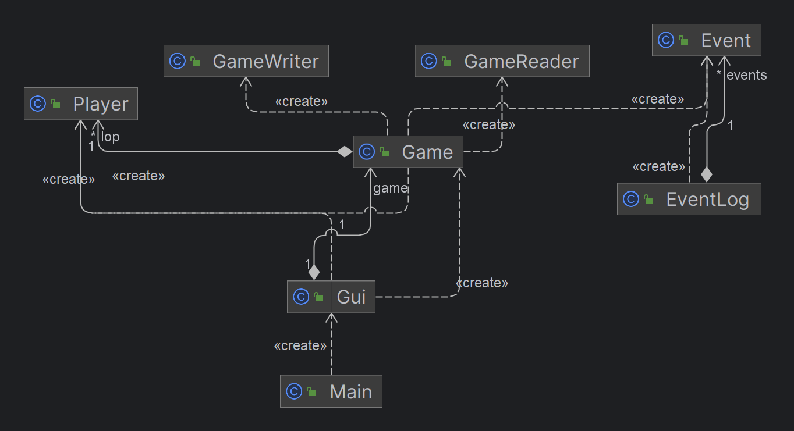

# COMPAS *(COMPuterized AtlaS)*

## A simple, fun game to play with friends

### What will the game do? 
COMPAS is a **computerized version of a word association game** where players take turns naming locations 
following a predefined sequence of letters. The original form of playing the game is verbal, in which
the players say the letters of the word "**ATLAS**" and the person on whom the "**S**" lands on starts the
game by naming a country/state/province/city and then the next person continues by doing the same using
the last letter of the previous name. Misses will lead to earning letters of the word "**LOSER**", and whoever
earns the word first is eliminated. 

In this version of the game, you can start a new game and choose from the 3 levels of difficulty:
- **EASY**: Names can include anything from countries to states/provinces and cities.
- **MEDIUM**: Names will include only countries and states/provinces. 
- **HARD**: Names will include only countries.

After that, you can add players(maximum 5) and type any names for each player. When the game starts,
COMPAS will assign a random letter from the word "ATLAS" to one of the players, and that player 
will start by naming a place which begins with that letter, and then the game continues in a similar manner.
There will be a time of 30 seconds for each turn, and wrong spellings will give you one retry.

_Note : Wrong spellings will allow one retry, but the timer will not reset._

You can save the game at any point, and load it from the same state the next time you play.  

### Who will play the game?
The game can be played by anyone of all age groups with some basic geographic knowledge. 

### Why is this project of interest to me?

- I can learn to create a real-life  version of a game that I've been playing since my childhood.
- It's fun.
- So that I can pass this course :stuck_out_tongue:

### User Stories
**As a user, I want to be able to:**
- Start a game.
- Have the option to save a game at any point before quitting.
- Load a game and resume from the same point where I left off.
- Add players to the game.
- Select a level of difficulty.
- Want to be able to retry if I misspell.
- Win/Lose a game.
- Resume my game from the point I left whenever I load a game.
- Display a list of players with the respective letters of the word "LOSER" 
- Quit the Game

### Instructions for the Grader
-   Start the game by running the Main file.
-   There will be a Main Menu with three options:  *New Game* , *Load Game* and  *Quit Game*.
-   Clicking  *New Game*  will open a new menu where you can select the number of players and then add them.
-   Clicking  *Quit Game*  will close  the application.
-   Clicking **Display** Players will open a new dialog box, where you can add a new player and change a player's name.

### Phase 4: Task 2
```
Fri Dec 01 09:51:50 PST 2023 : Game started.
Fri Dec 01 09:52:01 PST 2023 : Aarav added as a player.
Fri Dec 01 09:52:07 PST 2023 : Vaibhav added as a player.
Fri Dec 01 09:52:11 PST 2023 : Uday added as a player.
Fri Dec 01 09:52:15 PST 2023 : Displayed all players.
Fri Dec 01 09:52:22 PST 2023 : Shivangi added as a player.
Fri Dec 01 09:52:22 PST 2023 : Displayed all players.
Fri Dec 01 09:52:28 PST 2023 : Modified Uday to Bhavya.
Fri Dec 01 09:52:28 PST 2023 : Displayed all players.
Fri Dec 01 09:52:32 PST 2023 : Exited the game.
```

### Phase 4: Task 3

- Given additional time, I would have incorporated different Exception classes to effectively manage errors rather than relying solely on logging every detail to the console. This enhancement would contribute to a more robust error-handling system, allowing for a more organized and insightful approach to identifying and addressing issues within the application.
- I would have created a Game interface and two different classes called CliGame and GuiGame implementing it to separate my CLI code from the GUI one. This is because both the classes use the same functions to implement the same task on the CLI and the GUI. 
- I've noticed that the way my GUI components are currently connected is causing the generation of numerous instances of the super class, resulting in higher memory usage. To tackle this issue, I intend to implement the Singleton Design Pattern. This will guarantee that only one instance of the main window exists throughout the entire application, leading to a substantial reduction in memory consumption. Additionally, employing this design pattern will maintain consistent window state across all components.